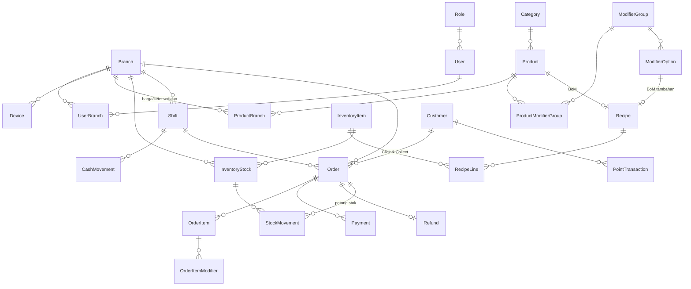

# Review skema database — Fase 1 PRD

Draft skema ada di [`packages/db/prisma/schema.prisma`](../packages/db/prisma/schema.prisma) (Prisma 7, PostgreSQL). **Belum ada migrasi dan belum ada CRUD.** Keduanya menunggu skema ini disetujui.

PRD lengkap: `prd-robbucca-v1.md` di folder project (`/mnt/project-files/prd/`).

## Yang sudah diverifikasi

- `prisma validate` dan `prisma format` lolos.
- `prisma db push` ke Postgres 16 sementara: 26 tabel terbentuk.
- Uji constraint dengan SQL langsung:
  - Pembayaran cabang SHT untuk pesanan cabang IJN **ditolak** (FK gabungan `orderId + branchId`).
  - Refund kedua untuk pesanan yang sama **ditolak** (`Refund.orderId` unik).
  - Nomor struk ganda di cabang yang sama **ditolak**; nomor yang sama di cabang lain **diterima**.
  - Mutasi stok untuk bahan yang tidak punya baris stok di cabang itu **ditolak**.
  - Potong stok BoM di cabang yang sama dengan `orderId` **diterima**.
- `pnpm typecheck` dan `pnpm build` lolos untuk api, pos, dan pwa. Tes POS lama (`npm test`) tetap 46 lulus.

## Gambaran relasi

## Keputusan desain

| Keputusan | Alasan |
| --- | --- |
| Semua tabel transaksi & stok punya `branchId`, dan relasinya memakai **FK gabungan `(id, branchId)`** | Database sendiri menolak data lintas cabang (mis. pembayaran cabang A ke pesanan cabang B). Tidak bergantung pada kode API. |
| Master data (Product, Category, Modifier, InventoryItem, Customer) **global**; per cabang lewat `ProductBranch` (harga khusus, tersedia/tidak) dan `InventoryStock` | PRD: menu terpusat, harga & stok per cabang. Sama dengan model POS lama. |
| ID memakai UUIDv7 yang dibuat di perangkat | POS harus tetap jualan saat offline lalu sinkron (PRD offline-first). |
| Uang dalam `Int` rupiah, persen dalam basis poin (`taxRateBp = 1000` = 10%), kuantitas stok `Decimal(14,3)` | Tidak ada pembulatan float. Gram/ml butuh desimal. |
| Kolom `version` di Order untuk optimistic concurrency | Mengganti "last write wins" berdasar jam perangkat di server lama, yang bisa menghilangkan pembayaran diam-diam. |
| `Refund.orderId` unik | Menutup temuan review kode: refund ganda. |
| `Payment.gatewayReference` unik | Webhook payment gateway yang terkirim dua kali tidak tercatat dua kali. |
| BoM: `Recipe` milik **produk atau opsi modifier**; opsi boleh berisi delta (mis. Large +60 ml susu, Oat menggantikan susu sapi dengan delta negatif) | PRD: penjualan memotong bahan baku sesuai BoM. |
| Snapshot nama, harga, pajak di `OrderItem`/`Order` | Laporan lama tidak berubah saat harga menu diubah. |
| Struk bernomor unik per cabang (`branchId + number`) | Sama dengan POS lama. |

## Pemetaan dari POS lama

| POS lama (`pos/js`, `server/`) | Skema baru |
| --- | --- |
| `branches` (pajak, servis, jam, kertas struk) | `Branch` |
| `staff` + PIN + izin (`perms.js`) | `User`, `Role.permissions`, `UserBranch` |
| perangkat terpasang (pairing) | `Device` |
| `menu.js` kategori, kelompok, stasiun, catatan cepat | `Category` (`group`, `station`, `quickNotes`) |
| item + varian ukuran/suhu/gula/es | `Product` + `ModifierGroup`/`ModifierOption` (+ `showWhenOptionIds` untuk pilihan bersyarat) |
| harga & stok habis per cabang | `ProductBranch` |
| stok bahan | `InventoryItem`, `InventoryStock`, `StockMovement` |
| shift, kas awal, setor/tarik kas | `Shift`, `CashMovement` |
| bill/order, item, void, diskon dengan approver | `Order`, `OrderItem`, `OrderItemModifier` |
| pembayaran tunai/QRIS/kartu | `Payment` |
| refund | `Refund` |
| audit log | `AuditLog` |
| (baru) pelanggan PWA & poin | `Customer`, `PointTransaction` |

## Belum masuk skema (sengaja)

- **Promo/voucher** dan **pengaturan organisasi**. POS lama punya promo; akan ditambah setelah alur dasar jalan.
- **Reservasi meja** dari PWA lama.
- **Delivery/ojol**: PRD hanya Click & Collect.
- **CHECK constraint** "Recipe harus milik tepat satu: produk atau opsi" belum bisa ditulis di Prisma. Akan ditulis di migrasi pertama.
- API belum tersambung ke `@robucca/db`. Itu dikerjakan bersama CRUD setelah skema disetujui.

## Pertanyaan untuk disetujui

1. **Peran**: PRD menyebut Super Admin, Branch Manager, Cashier. Skema menambah **KITCHEN** untuk layar dapur. Setuju?
2. **Refund**: hanya **refund penuh**, dan hanya di **cabang yang sama** dengan pesanan. Perlu refund sebagian?
3. **BoM ukuran**: Large disimpan sebagai delta di opsi. Kombinasi yang saling bergantung (Large + Oat = oat lebih banyak) tidak bisa diwakili delta sederhana. Cukup, atau perlu resep per varian?
4. **PIN kasir** 4–6 digit di-hash bcrypt. Tetap mudah ditebak bila hash bocor; perlu batas percobaan di API. Setuju?
5. **Nama kolom**: tetap camelCase bawaan Prisma, atau dipetakan ke snake_case di database?
6. **Delivery/ojol** tetap di luar cakupan seperti PRD?
